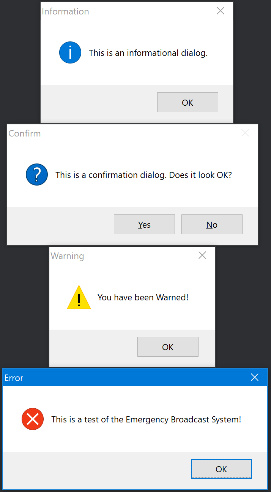

# DelphiMessageDlg
Show the 4 standard MessageDlg types from various versions of Delphi

Here's what the 4 types of dialog boxes look like in a VCL app on Windows 10:

Here's what the same 4 types look like when run from a FireMonkey app on Windows 10:

